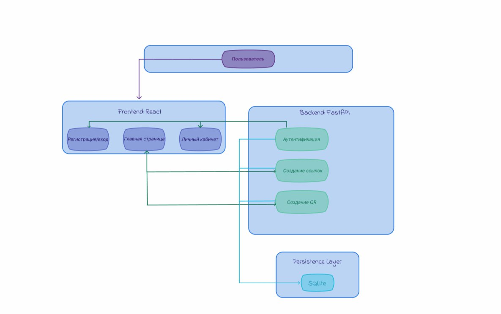
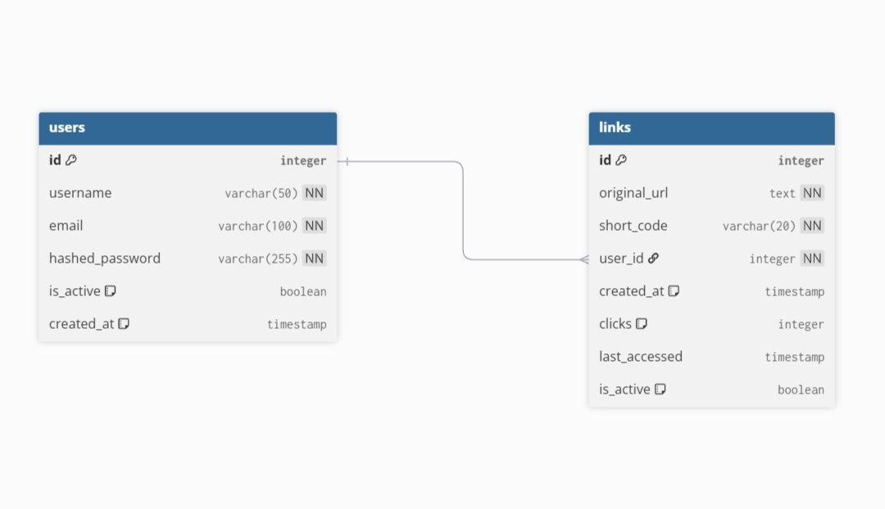

# Relink

Сервис для создания коротких ссылок и QR-кодов

**Relink** — это веб-приложение, которое позволяет пользователям сокращать длинные URL, получать для них QR-коды и отслеживать статистику переходов. Проект реализован в формате MVP и ориентирован на простоту использования и быстрый старт.

## Описание проекта

Relink решает повседневную задачу: превращает длинные и нечитаемые URL в короткие и аккуратные, а также генерирует QR-коды для быстрого доступа с мобильных устройств.

### Ключевые возможности

- **Авторизация пользователей**: Регистрация и вход по email и паролю. Каждый пользователь работает со своим списком ссылок.
- **Создание коротких ссылок**: Вставьте длинный URL — получите короткий вида `rel.ink/abc123`. Код генерируется автоматически.
- **QR-коды**: Для каждой короткой ссылки автоматически создаётся QR-код. Его можно скачать в формате PNG и использовать в печати, на экранах или в презентациях.
- **Статистика переходов**: По каждой ссылке видно, сколько раз по ней кликнули, а также список последних переходов (с временем и источником).
- **Личный кабинет**: Все созданные ссылки и QR-коды хранятся в одном месте. Можно просматривать, искать и удалять их.
- **Редирект**: При переходе по короткой ссылке пользователь автоматически перенаправляется на исходный URL.

## Страницы приложения

- **Авторизация** — вход и регистрация новых пользователей.
- **Главная страница** — центральный экран с выбором действия: создать новую ссылку или QR-код. Также доступен переход в личный кабинет.
- **Личный кабинет (Dashboard)** — управление ссылками, просмотр статистики и информации о запросах клиентов (дата создания, количество переходов, последние клики).

## Стек технологий

### Основное

- **FastAPI** — современный асинхронный веб-фреймворк на Python. Обеспечивает высокую производительность и автоматическую документацию API.
- **React** — библиотека для построения пользовательского интерфейса. Используется для создания SPA с удобной навигацией.
- **SQLite** — легковесная встраиваемая база данных. Не требует отдельного сервера, идеально подходит для MVP и разработки.

### Безопасность

- **python-jose** — работа с JWT-токенами (аутентификация).
- **passlib[bcrypt]** — хеширование паролей пользователей.

### Генерация QR-кодов

- **qrcode** — генерация QR-кодов на сервере.
- **Pillow** — обработка и сохранение изображений.

### Инструменты

- **Docker / Docker Compose** — контейнеризация приложения для простого развертывания.
- **Git (Сфера.Код)** — система контроля версий.
- **npm / yarn** — менеджеры пакетов для фронтенда.

## Зависимости

### Для разработчика
- Python 3.11+
- Node.js 18+ и npm/yarn
- Git

## Архитектура проекта

    

## Структура проекта 

## Схема базы данных

    

